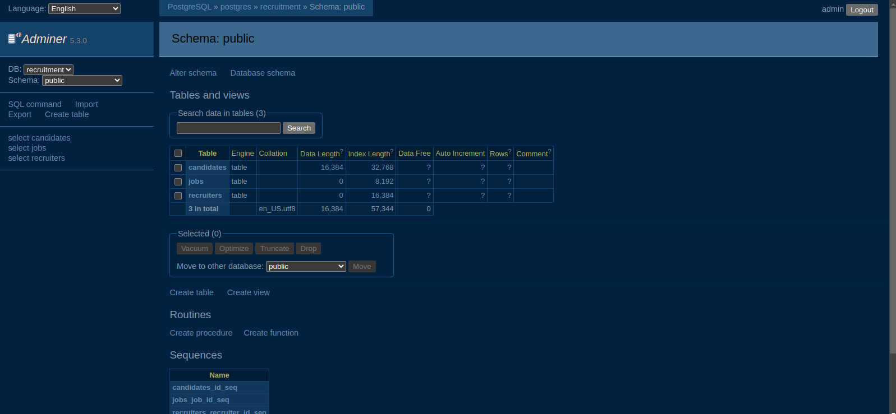

# Manatal Sync PostgreSQL Project

A Python-based data synchronization tool for managing recruitment data with PostgreSQL database using Docker containers.

## 📋 Table of Contents

- [Overview](#overview)
- [Architecture](#architecture)
- [Prerequisites](#prerequisites)
- [Project Setup](#project-setup)
- [Usage](#usage)
- [Database Schema](#database-schema)
- [Development](#development)
- [Collaboration Guidelines](#collaboration-guidelines)
- [Best Practices](#best-practices)
- [Troubleshooting](#troubleshooting)
- [Contributing](#contributing)

## 🎯 Overview

This project provides a robust solution for synchronizing recruitment data between CSV files and a PostgreSQL database. It includes data validation, conflict resolution, and a web-based database administration interface.

### Key Features

- 🔄 **Data Synchronization**: Automated CSV to PostgreSQL data sync
- 🐳 **Dockerized Environment**: Complete containerized setup
- 🗄️ **Database Management**: PostgreSQL with Adminer web interface
- 📊 **Data Validation**: Built-in data cleaning and normalization
- 🔍 **Reporting**: Pre-built queries for data analysis
- 🚀 **Health Checks**: Container health monitoring

## 🏗️ Architecture

```
┌─────────────────┐    ┌──────────────────┐    ┌─────────────────┐
│   CSV Data      │───▶│   Sync App       │───▶│   PostgreSQL    │
│   (data/)       │    │   (Python)       │    │   Database      │
└─────────────────┘    └──────────────────┘    └─────────────────┘
                                │                        │
                                ▼                        ▼
                       ┌──────────────────┐    ┌─────────────────┐
                       │   Data           │    │   Adminer       │
                       │   Validation     │    │   Web UI        │
                       └──────────────────┘    └─────────────────┘
```

## ✅ Prerequisites

Before setting up the project, ensure you have the following installed:

- **Docker**: Version 20.10+ ([Install Docker](https://docs.docker.com/get-docker/))
- **Docker Compose**: Version 2.0+ ([Install Docker Compose](https://docs.docker.com/compose/install/))
- **Git**: For version control
- **Text Editor**: VS Code, PyCharm, or similar

### System Requirements

- **OS**: Linux, macOS, or Windows with WSL2
- **RAM**: Minimum 4GB (8GB recommended)
- **Storage**: At least 2GB free space

## 🚀 Project Setup

### 1. Clone the Repository

```bash
git clone https://github.com/Rugwiroparfait/manatal-sync-postgres.git
cd manatal-sync-postgres
```

### 2. Environment Configuration

Create your environment file (`.env` is already provided):

```bash
# Database Configuration
POSTGRES_DB=recruitment
POSTGRES_USER=admin
POSTGRES_PASSWORD=admin123
POSTGRES_HOST=postgres
POSTGRES_PORT=5432
```

> ⚠️ **Security Note**: Change the default credentials in production environments!

### 3. Start the Services

Launch all services using Docker Compose:

```bash
# Start all services in detached mode
docker-compose up -d

# View logs (optional)
docker-compose logs -f
```

### 4. Verify Setup

Check that all services are running:

```bash
docker-compose ps
```

Expected output:
```
NAME                   COMMAND                  SERVICE             STATUS              PORTS
recruitment_adminer    "entrypoint.sh docke…"   adminer             running             0.0.0.0:8080->8080/tcp
recruitment_db         "docker-entrypoint.s…"   postgres            running (healthy)   0.0.0.0:5433->5432/tcp
recruitment_sync       "python src/sync_dat…"   sync_app            exited (0)
```

### 5. Access the Database Interface

Open your web browser and navigate to: http://localhost:8080


**Login Credentials:**
- **System**: PostgreSQL
- **Server**: postgres
- **Username**: admin
- **Password**: admin123
- **Database**: recruitment


### 6. Explore Database Schema

After logging in, you can explore the database structure:



## 📊 Usage

### Data Synchronization

The sync application automatically processes CSV files from the `data/` directory:

```bash
# Run sync manually
docker-compose run --rm sync_app python src/sync_data.py

# Or restart the sync service
docker-compose restart sync_app
```

### Data Filtering and Queries

Use the built-in reporting module:

```bash
# Generate reports
docker-compose run --rm sync_app python src/report_queries.py
```


### Adding New Data

1. Place CSV files in the `data/` directory
2. Ensure CSV format matches the expected schema:
   ```csv
   first_name,last_name,email,phone,skills
   John,Doe,john@example.com,555-0123,"Python, SQL"
   ```
3. Run the sync process

## 🗄️ Database Schema

The project uses a comprehensive recruitment database schema:

### Core Tables

- **candidates**: Store candidate information
- **recruiters**: Manage recruiter data
- **jobs**: Job postings and details
- **applications**: Track job applications

### Relationships

```sql
candidates (1) ──── (many) applications (many) ──── (1) jobs
                                                           │
                                                    (many) │ (1)
                                                    recruiters
```

## 💻 Development

### Local Development Setup

For development without Docker:

```bash
# Create virtual environment
python -m venv venv
source venv/bin/activate  # Linux/macOS
# venv\Scripts\activate   # Windows

# Install dependencies
pip install -r requirements.txt

# Set environment variables
export POSTGRES_HOST=localhost
export POSTGRES_PORT=5433
```

### Project Structure

```
manatal-sync-postgres/
├── 📁 data/                    # CSV data files
│   └── mock_candidates.csv
├── 📁 screenshots/             # Documentation images
├── 📁 sql/                     # Database scripts
│   ├── init.sql               # Initial table creation
│   └── schema.sql             # Complete schema
├── 📁 src/                     # Python source code
│   ├── config.py              # Configuration management
│   ├── db_connection.py       # Database connectivity
│   ├── report_queries.py      # Reporting functions
│   ├── sync_data.py           # Main sync logic
│   └── validate_data.py       # Data validation
├── docker-compose.yml         # Docker services configuration
├── dockerfile                 # Python app container
├── requirements.txt           # Python dependencies
└── .env                       # Environment variables
```

### Running Tests

```bash
# Add your test commands here
python -m pytest tests/  # When test suite is added
```

## 🤝 Collaboration Guidelines

### Git Workflow

We follow a **Feature Branch Workflow** for better collaboration:

1. **Create Feature Branches**:
   ```bash
   git checkout -b feature/your-feature-name
   git checkout -b bugfix/issue-description
   git checkout -b hotfix/critical-fix
   ```

2. **Commit Messages**: Use conventional commits:
   ```bash
   git commit -m "feat: add new data validation for phone numbers"
   git commit -m "fix: resolve database connection timeout issue"
   git commit -m "docs: update README with setup instructions"
   ```

3. **Pull Request Process**:
   - Create descriptive PRs with clear titles
   - Include screenshots for UI changes
   - Reference related issues: `Fixes #123`
   - Request reviews from team members

### Code Review Standards

- ✅ **Code Quality**: Follow PEP 8 for Python code
- ✅ **Documentation**: Update README for new features
- ✅ **Testing**: Add tests for new functionality
- ✅ **Environment**: Test in Docker containers
- ✅ **Security**: No hardcoded credentials

### Communication

- **Issues**: Use GitHub Issues for bug reports and feature requests
- **Discussions**: Use GitHub Discussions for questions and ideas
- **Documentation**: Keep README and code comments updated

## 🛡️ Best Practices

### Security

- ✅ Use environment variables for sensitive data
- ✅ Regularly update dependencies
- ✅ Don't commit `.env` files with real credentials
- ✅ Use least-privilege database users
- ✅ Enable container health checks

### Database

- ✅ Use transactions for data integrity
- ✅ Implement proper error handling
- ✅ Use prepared statements to prevent SQL injection
- ✅ Regular database backups
- ✅ Monitor database performance

### Docker

- ✅ Use specific image tags (avoid `:latest` in production)
- ✅ Implement health checks for all services
- ✅ Use multi-stage builds for optimization
- ✅ Mount volumes for persistent data
- ✅ Use Docker networks for service communication

### Code Quality

- ✅ Follow consistent naming conventions
- ✅ Write descriptive commit messages
- ✅ Keep functions small and focused
- ✅ Add comprehensive error handling
- ✅ Document complex business logic

### Performance

- ✅ Use connection pooling for database connections
- ✅ Implement batch processing for large datasets
- ✅ Monitor resource usage
- ✅ Use appropriate indexes on database tables
- ✅ Optimize Docker image sizes

## 🔧 Troubleshooting

### Common Issues

#### Container Connection Problems

```bash
# Check container status
docker-compose ps

# Check container logs
docker-compose logs postgres
docker-compose logs sync_app

# Restart services
docker-compose restart
```

#### Database Connection Errors

```bash
# Verify database is healthy
docker-compose exec postgres pg_isready -U admin -d recruitment

# Check port conflicts
netstat -tulpn | grep 5433
```

#### Permission Issues

```bash
# Fix file permissions
chmod -R 755 data/
chmod -R 755 src/
```

### Debug Mode

Enable debug logging by modifying the Docker Compose file:

```yaml
environment:
  - DEBUG=true
  - LOG_LEVEL=DEBUG
```

### Database Recovery

```bash
# Backup database
docker-compose exec postgres pg_dump -U admin recruitment > backup.sql

# Restore database
docker-compose exec -i postgres psql -U admin recruitment < backup.sql
```

## 🧪 Testing

### Running Tests

```bash
# Unit tests (when available)
docker-compose run --rm sync_app python -m pytest

# Integration tests
docker-compose run --rm sync_app python tests/integration_test.py
```

### Data Validation Testing

```bash
# Test data validation functions
docker-compose run --rm sync_app python -c "
from src.validate_data import clean_phone, normalize_email
print(clean_phone('(555) 123-4567'))  # Should output: 5551234567
print(normalize_email(' USER@EXAMPLE.COM '))  # Should output: user@example.com
"
```

## 📈 Monitoring

### Health Checks

All services include health checks:

```bash
# Check service health
docker-compose ps --format "table {{.Name}}\t{{.Status}}"
```

### Logs Monitoring

```bash
# Follow logs in real-time
docker-compose logs -f

# View specific service logs
docker-compose logs postgres
docker-compose logs sync_app
```

## 🤝 Contributing

We welcome contributions! Please follow these guidelines:

### Getting Started

1. **Fork** the repository
2. **Clone** your fork locally
3. **Create** a feature branch
4. **Make** your changes
5. **Test** thoroughly
6. **Submit** a pull request

### Contribution Checklist

- [ ] Code follows project style guidelines
- [ ] Tests pass and new tests added if needed
- [ ] Documentation updated
- [ ] Screenshots included for UI changes
- [ ] Environment variables documented
- [ ] Docker containers build successfully

### Reporting Issues

When reporting issues, please include:

- **Environment details** (OS, Docker version)
- **Steps to reproduce** the issue
- **Expected vs actual behavior**
- **Relevant logs or screenshots**
- **Possible solutions** you've tried

## 📄 License

This project is licensed under the MIT License - see the [LICENSE](LICENSE) file for details.

## 🙏 Acknowledgments

- **PostgreSQL Team** for the robust database system
- **Docker Community** for containerization tools
- **Adminer Team** for the database management interface
- **Python Community** for excellent libraries

---

**Happy Coding! 🚀**

For questions or support, please open an issue or reach out to the maintainers.

*Last updated: August 12, 2025*
